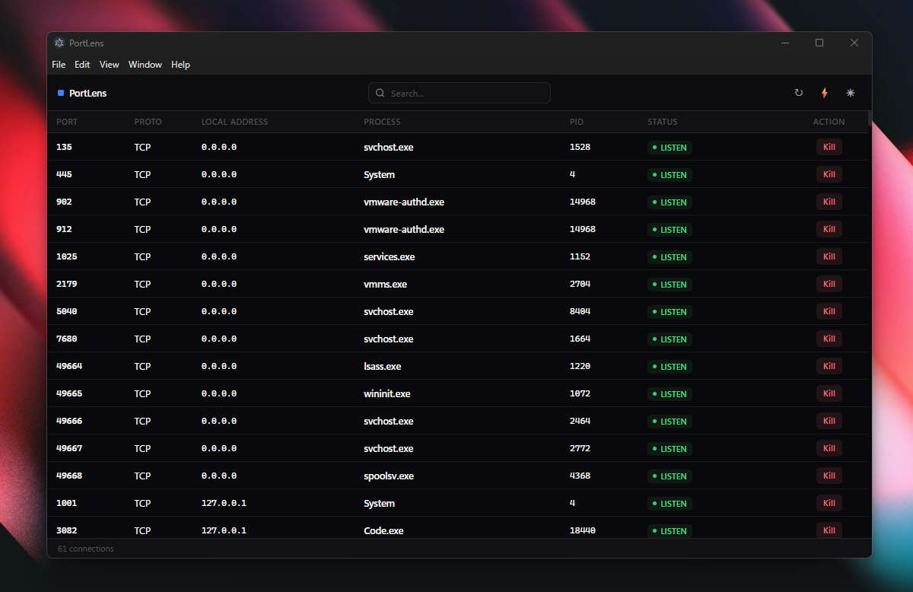

# PortLens

A lightweight cross-platform desktop app for monitoring active TCP/UDP ports and their processes in real time.

  

## Screenshot



## Features

- Live table of all active TCP and UDP connections, refreshed every 2.5 seconds
- Shows Port, Protocol, Local Address, Process Name, PID, and Status
- Filter connections instantly by port, address, or process name
- Kill any process directly from the table (with confirmation)
- Restart WinNAT service in one click to fix EACCES port permission errors (Windows)
- Manual refresh button
- Dark and light themes — respects your system preference on first launch, persists your choice
- Minimal footprint: no heavy UI frameworks, pure React + CSS variables

## Getting Started

### Prerequisites

- [Node.js](https://nodejs.org/) 18 or later
- npm 9 or later

### Install

```bash
git clone <repo-url>
cd port-lens
npm install
```

### Run (development)

```bash
npm start
```

Opens the app with hot reload. DevTools are open automatically in development mode.

### Build

```bash
# Package without installer (faster, output in out/)
npm run package

# Build distributable installer
npm run make
```

| Platform | Output format               |
| -------- | --------------------------- |
| Windows  | Squirrel installer (`.exe`) |
| macOS    | ZIP archive                 |
| Linux    | RPM + DEB packages          |

Outputs land in the `out/` directory.

## Project Structure

```
src/
├── main.ts                  — Electron main process: window, IPC, scanner lifecycle
├── preload.ts               — contextBridge API exposed to renderer (window.portLens)
├── renderer.ts              — Renderer entry point
├── app.tsx                  — React root component
├── types/
│   ├── port.ts              — PortEntry interface
│   └── global.d.ts          — window.portLens TypeScript declarations
├── services/
│   └── portScanner.ts       — Cross-platform port scanning and process killing
├── components/
│   ├── PortTable.tsx        — Table container
│   ├── TableRow.tsx         — Single row (React.memo for efficient updates)
│   ├── Toolbar.tsx          — Search, refresh, WinNAT restart, theme toggle
│   ├── StatusBar.tsx        — Sticky footer with connection count
│   └── StatusBadge.tsx      — Colored status pill
├── hooks/
│   └── useTheme.ts          — Theme detection, toggle, and persistence
└── styles/
    ├── variables.css        — CSS custom properties for light and dark themes
    └── app.css              — All component styles
```

## How It Works

The main process runs a `PortScanner` service that polls every 2.5 seconds using platform-native commands:

| Platform | Command                                       |
| -------- | --------------------------------------------- |
| Windows  | `netstat -ano` + `tasklist` for process names |
| macOS    | `lsof -i -n -P`                               |
| Linux    | `ss -tulnp` (fallback: `lsof -i -n -P`)       |

Results are pushed to the renderer via Electron IPC (`webContents.send`). The renderer is purely reactive — it only re-renders rows that actually changed, using stable React keys (`protocol-port-pid`) and `React.memo`.

Killing a process runs `taskkill /PID <pid> /F` on Windows or `kill -9 <pid>` on macOS/Linux. Permission errors are shown as an alert in the UI.

## IPC Channels

| Channel          | Direction       | Description                        |
| ---------------- | --------------- | ---------------------------------- |
| `ports:update`   | main → renderer | Full port list push                |
| `ports:refresh`  | renderer → main | Trigger immediate scan             |
| `ports:kill`     | renderer ↔ main | Kill a process by PID              |
| `winnat:restart` | renderer ↔ main | Restart WinNAT via elevated shell  |

## Fixing EACCES Port Errors (Windows)

If you see `Error: listen EACCES: permission denied`, click the ⚡ button in the toolbar. This restarts the Windows NAT driver (`net stop winnat && net start winnat`) via a UAC-elevated prompt, which clears the port reservation conflict.
